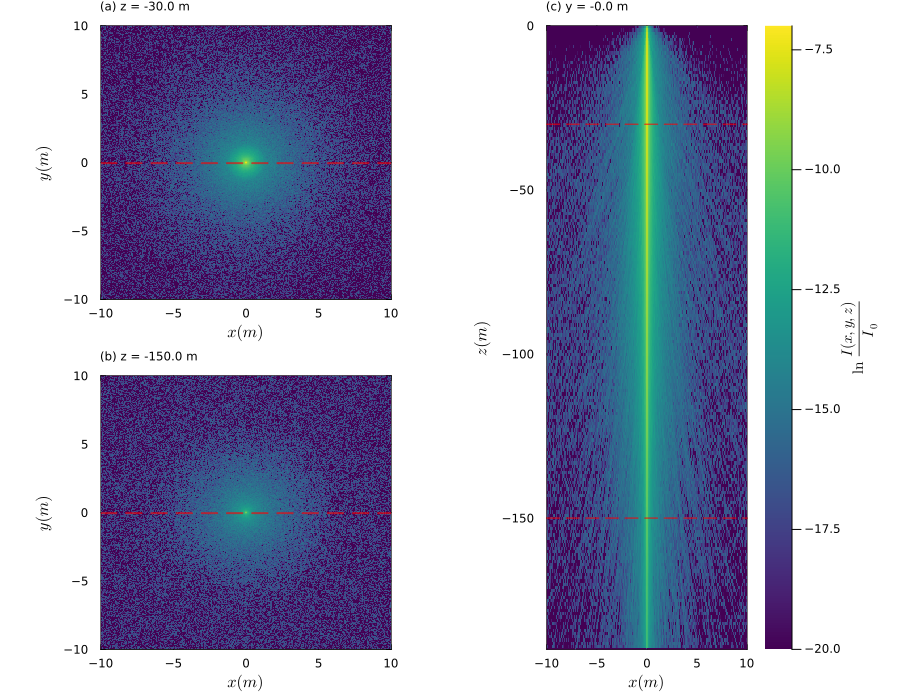

# OceanLight.jl Documentation

## Overview 

**OceanLight.jl** calculates the downwelling irradiance field in the upper ocean. By implementing the Monte Carlo method, this simulation achieves the path of Photons: starting from the refraction in the air-water interface, to some specific depth underneath the water body. 

## Quick Install 

```@example
using Pkg
Pkg.add("OceanLight");
```

## Result

```@raw html

```
*Simulation of 1e7 Photons at the center with no surface elevation, in 80 m by 80 m by 190 m physical size with 512 by 512 by 190 resolution, absorbtance coefficent a = 0.0196 and scattering coefficient b = 0.0031. Sub-Figure 1: X-Y cross section at 30 m depth. Sub-Figure 2: X-Y cross section at 150 m depth. Sub-Figure 3: X-Z cross section at the center.*


```@raw html

```
*Simulation of 100 Photons at the every grid point with observed surface elevation, in 80 m by 80 m by 190 m physical size with 512 by 512 by 190 resolution, absorbtance coefficent a = 0.0196 and scattering coefficient b = 0.0031. Sub-Figure 1: X-Y cross section at 30 m depth. Sub-Figure 2: X-Y cross section at 150 m depth. Sub-Figure 3: X-Z cross section at the center.*