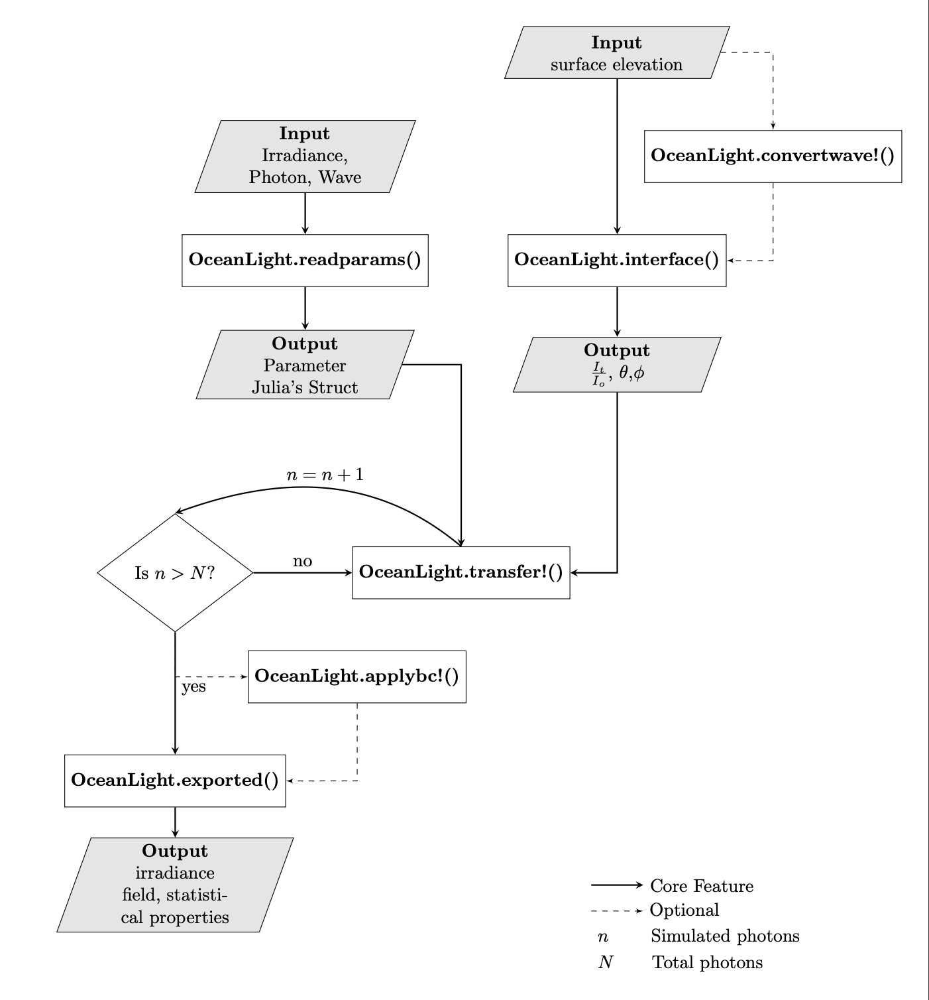

# Summary

`OceanLight` is a Julia-based scientific package that simulates photon trajectories and stores their downward irradiance field in three-dimensional space using direct Monte Carlo time-independent simulation. The simulated photon trajectories begin in the air phase, interact with the water surface, refract and transfer into water, then travel, and scatter until they are either absorbed or reach the bottom of the field of interest. `OceanLight` automates the entire procedure of a photon's sequence of events, including determining its fate and storing its landing position, which can later be exported and accessed in `.h5` format.

# Statement of need

Optical Oceanography concerns all aspects of light and its interaction with seawater. This field is crucial for addressing problems related to physical, biological, and chemical oceanographic processes, such as phytoplankton photosynthesis, biogeochemical cycles, and recent rapid climate change [@Dickey:2011;@Dickey:2006]. However, because of the complex interaction of light free surface wave geometry, the irradiance distribution can be highly fluctuated [@Darecki:2011;@Gernez:2011], thus deem difficult to obtain analytical solution. One of the prominent numerical methods is implementing the Monte Carlo (MC) method to approximate the light field. The general idea is to construct probability distributions of entire sequences by repeatedly sampling random photon trajectories, including their scattering, absorption, and path lengths. This method proves to be powerful, despite being generic [@Mobley:1994]. The MC method has been widely implemented on various problems regarding to the calculation of downward irradiance field, for instance, the Monte Carlo radiative transfer solver as a function of the shadowing effect and detector size [@Xu:2014] or the Direct Monte Carlo simulation on both polarized and unpolarized light [@Xu:2011].   

Here, we introduce `OceanLight`, a Julia-based software package that facilitates three-dimensional, direct Monte Carlo time-independent simulation of light fields within seawater. `OceanLight` is based on Forward Monte Carlo Methods as described by @Mobley:1994. The extension of light refraction between air-water interfaces is implemented, such that the refracted angle in the water phase is governed by Snell's Law, and the proportion of the light being transmitted is based on Fresnel equations. The probability distribution of scattering polar angles is based on data measured by @Petzold:1972 [@Kirk:1981]. Additionally, `OceanLight` supports parallel computing implementation, improving performance and reducing computational time. Furthermore, the downwelling irradiance fields generated by `OceanLight` provide an ample resource for Machine Learning implementation, an accelerated model that requires less computational cost, but whose accuracy is strongly dependent on the amount of training data. Since its development, it has been used for generating the training data for Deep Neural Network and validating their results [@Hao:2022]. 

# Main Features

The main feature of ‘OceanLight’ is described in figure 2.

`OceanLight` required users’ input data in three categories.

1. **Irradiance:** resolution of the solution grid, attenuated coefficient, and specifying boundary condition 
2. **Photon:** number of Photons and grid spacing
3. **Wave:** surface elevation and other attribution 

`OceanLight` reads input data from `.yml` files and stores it in Julia's `struct` format. Another input is the surface wave attributes, consisting of surface elevation and its corresponding partial derivatives in x and y directions. For this data, users can either generate random surface elevations using `OceanLight.setwave!` or import their own data and convert it to fit the incoming photon grid using `OceanLight.convertwave!`.

During the interaction between air and water phases, `OceanLight.interface` calculates the polar angle $\theta$ and azimuthal angle $\phi$ at which photons are transmitted through water using Snell's Law, and determines the ratio of transmitted to reflected photons using Fresnel's Equations.

After photons are transmitted into the water, `OceanLight.transfer` computes the direct Monte Carlo method for each photon: tracking its trajectory, storing its landing position, determining whether it is absorbed or scattered, and repeating the iteration until the photon is absorbed or reaches the bottom of the field of interest. To implement parallel computing with OpenMPI software, users distribute the number of photons evenly across CPU threads and, after completing the simulation, combine all results to form an irradiance field.

The data can be exported in `.h5` format using `OceanLight.exported`. Users can access the full three-dimensional irradiance field and its statistical properties.

To demonstrate the utilities of this package, we calculate the downwelling irradiance in two cases:

* Flat water surface $\left( \eta_{x} = \eta_{y} = 0  \right)$ with light intensity focused only in the center of the spatial domain of size $x,y \in [\mathrm{−10m},\mathrm{10m}]$ ($10^{8}$ photons at a single point in the center)

* Imported geometry based on observed surface elevation, with light intensity distributed evenly across the entire spatial domain of size $x,y \in [\mathrm{−40m},\mathrm{40m}]$ ($10^{3}$ photons at every points)

In both cases, the optical property of water is the same, with absorbance coefficient $a = 0.0196$ and scattering coefficient $b = 0.0031$, which represents the attenuation coefficient of sea water at wavelength $490 \mathrm{nm}$ [Smith:1981]. The spatial grid size in both x and y directions is carefully chosen such that the lowest wave numbers that can be captured during the derivative of surface elevation is `pex` and `pey`. The downward irradiance is stored in a domain of $512 \times 512 \times 190$ grid points, with a depth spatial domain of size $z \in [\mathrm{−190m},\mathrm{10m}]$. The periodic boundary condition is implemented on all sides. 

With the flat surface, most of the photons transmit directly at a right angle to the surface, based on the ratio given by the Fresnel equation. In the second case, we consider a more realistic scenario, with imported geometry based on the observed surface elevation and even distribution of incoming light. The spatial grid spacing of incoming photons is the same as `dx` and `dy` being used in the calculation grid. 

# Acknowledgement 

Xuanting Hao contributes on the code implementation and numerical portion of the problem. Pacharadech Wacharanan contribute on organization and documentation part of the numerical solver. Authors wish to thank Sai Pramod Anumula and Yifeng Mao for valuable feedback and comment on this project. 

# References

